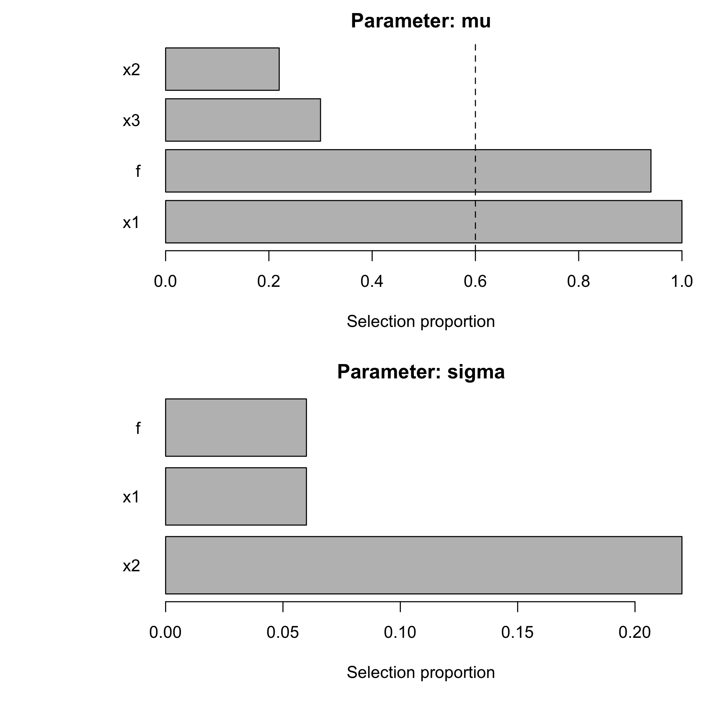
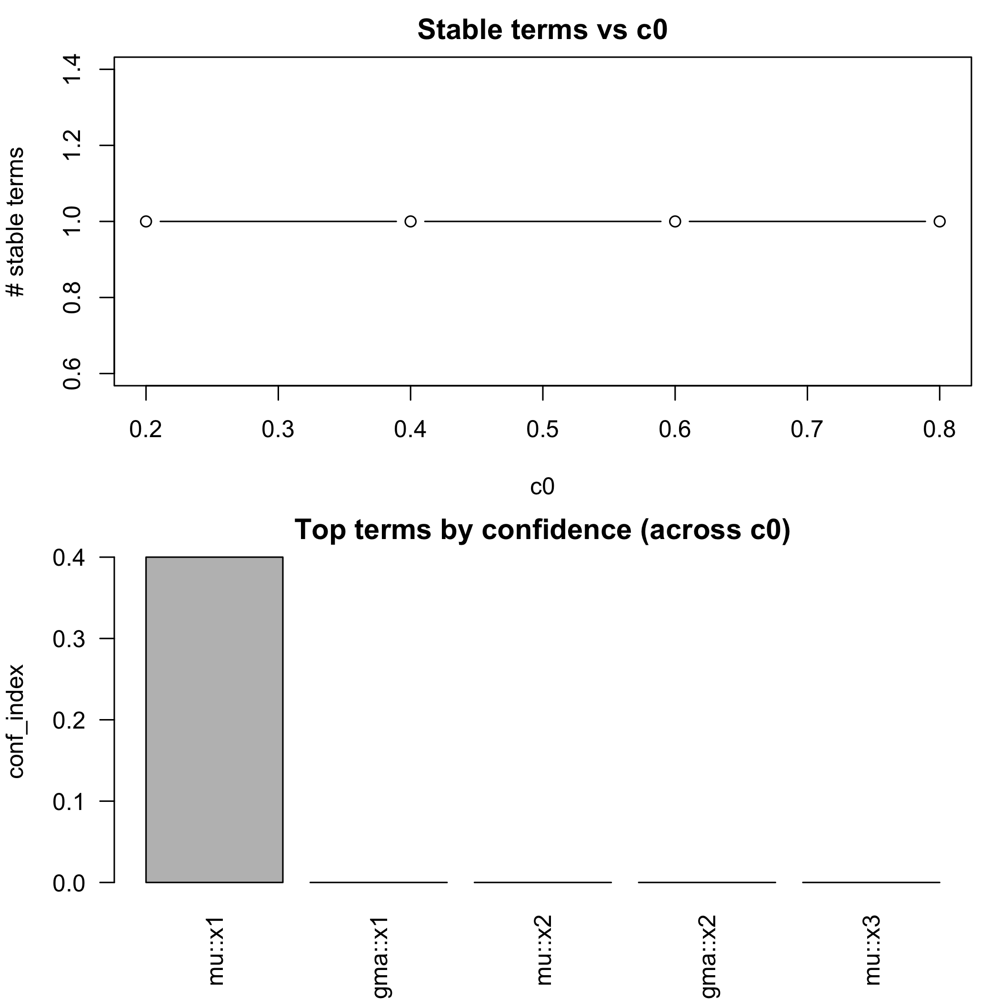
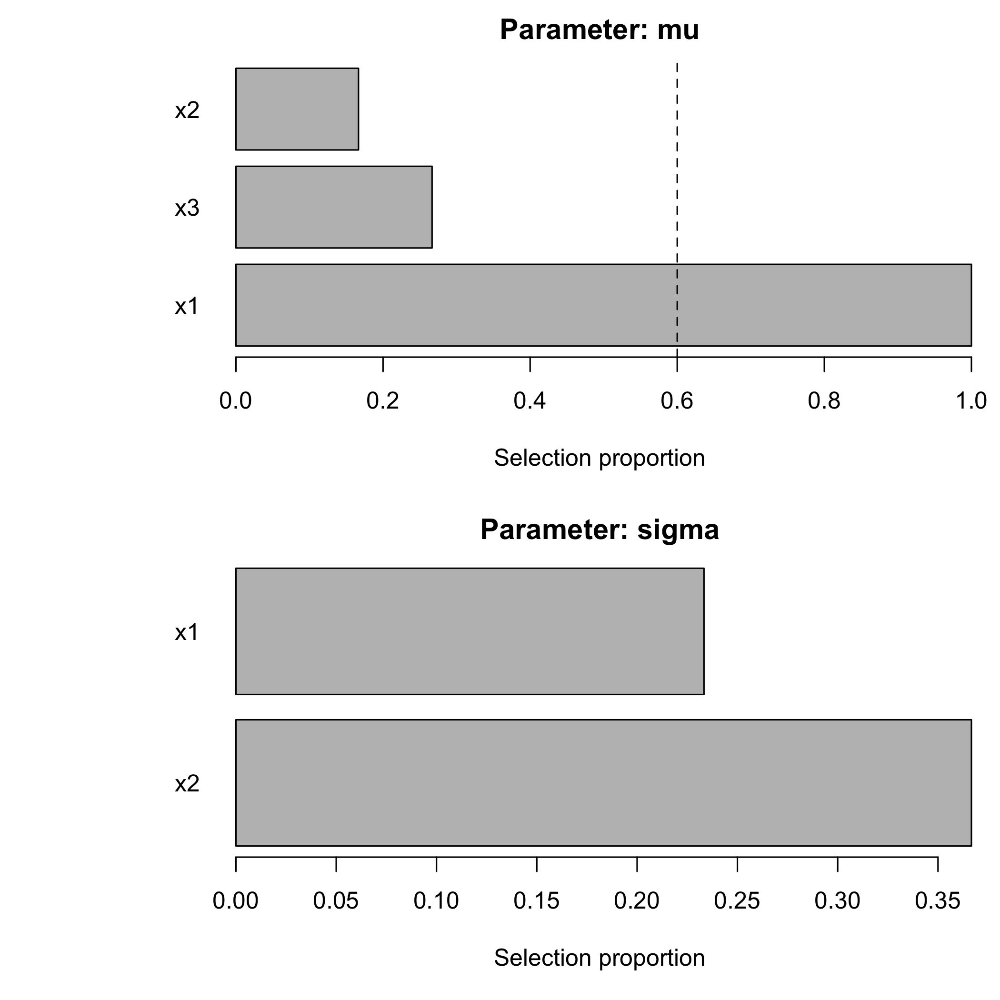
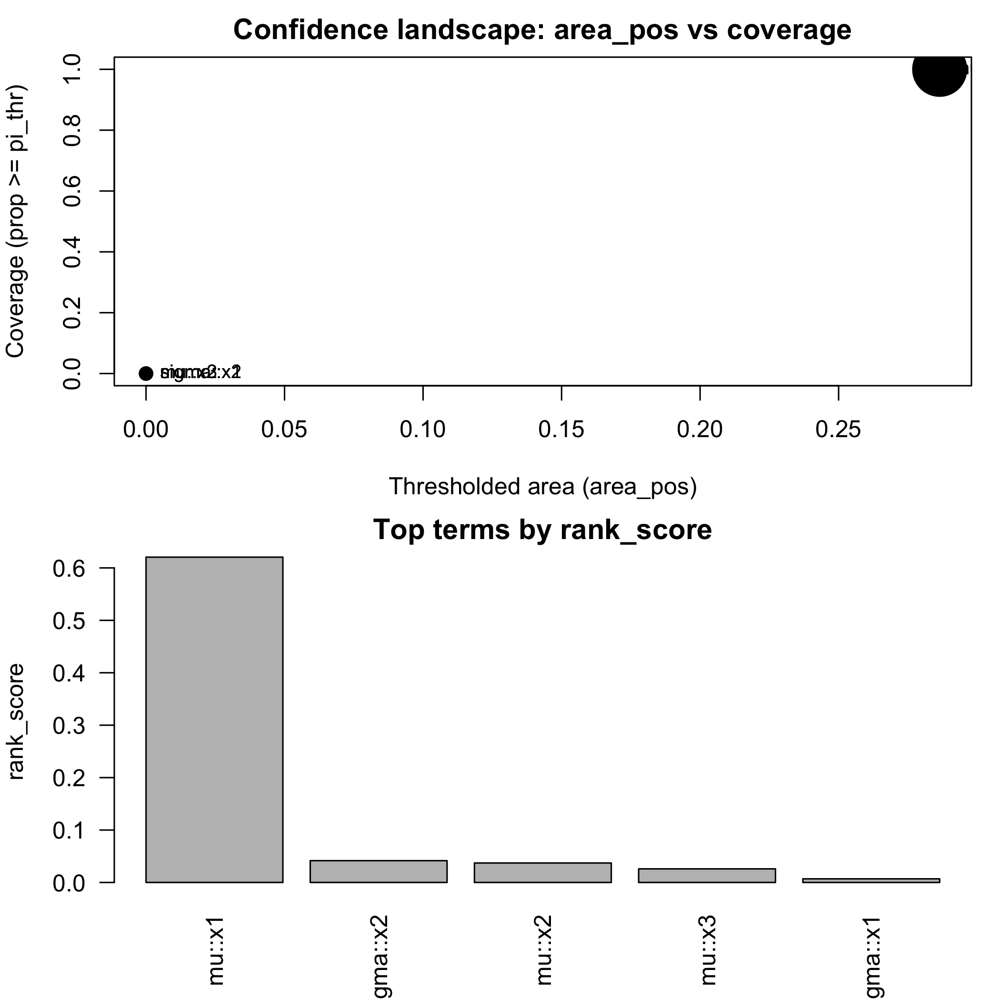
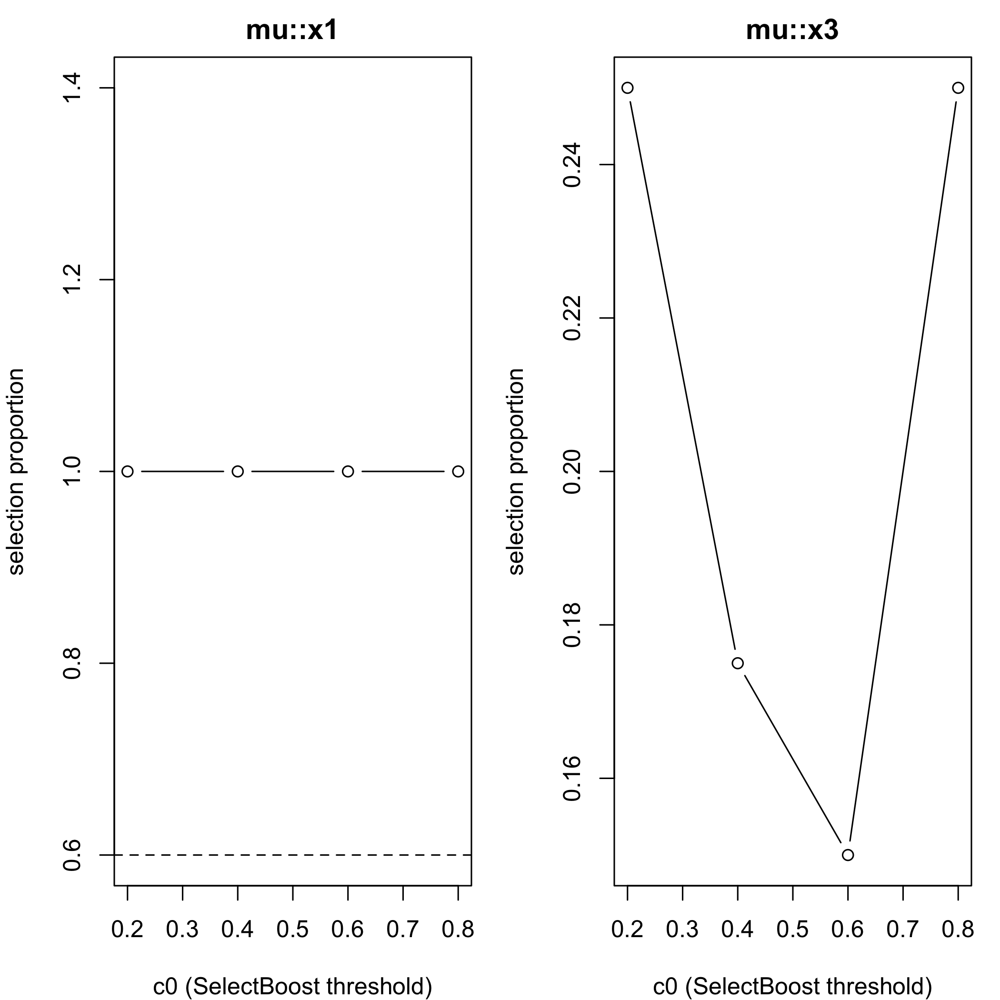

<!-- README.md is generated from README.Rmd. Please edit that file -->


# SelectBoost.gamlss 

<!-- badges: start -->
<!-- [](https://doi.org/10.32614/CRAN.package.SelectBoost.gamlss) -->
[](https://github.com/fbertran/SelectBoost.gamlss/actions)
<!-- [](https://cran.r-project.org/package=SelectBoost.gamlss) -->
<!-- badges: end -->

**SelectBoost.gamlss** delivers correlation-aware, bootstrap-based stability-selection for Generalized Additive Models for Location, Scale and Shape (GAMLSS) and quantile regression. It extends the [SelectBoost](https://doi.org/10.1093/bioinformatics/btaa855) algorithm so that you can work with multiple distributional parameters, mix-and-match sparse penalties, and interrogate the resulting models with rich visual summaries.

> **Conference highlight.** SelectBoost for GAMLSS and quantile regression was presented at the Joint Statistics Meetings 2024 (Portland, OR) in the talk *"An Improvement for Variable Selection for Generalized Additive Models for Location, Shape and Scale and Quantile Regression"* (F. Bertrand & M. Maumy). Correlation-aware resampling markedly improves recall and precision in high-dimensional, highly correlated settings.

## Why SelectBoost.gamlss?

* **Stable variable selection under correlation.** Group correlated predictors and sample one representative per bootstrap (c0 groups) to avoid selecting redundant surrogates.
* **Distribution-aware engines.** Optimise μ, σ, ν, and τ formulas simultaneously with stepwise GAIC, glmnet penalties, grouped penalties, or sparse-group penalties.
* **Actionable summaries.** Inspect stability tables, effect plots, correlation-aware confidence functionals, and deviance benchmarks in one workflow.
* **Fast + scalable.** Rcpp-backed preprocessing, optional `future.apply` parallelism, and deviance shortcuts keep large bootstrap campaigns practical.

## Capabilities at a glance

| Capability | Key helpers | What you get |
|------------|-------------|--------------|
| Stability selection with SelectBoost | `sb_gamlss()`, `selection_table()`, `plot_sb_gamlss()` | Confidence-style inclusion probabilities for each parameter. |
| Automated c0 search | `sb_gamlss_c0_grid()`, `autoboost_gamlss()`, `fastboost_gamlss()` | Grid, automatic, and lightweight bootstrap strategies. |
| Flexible engines | `engine`, `engine_sigma`, `engine_nu`, `engine_tau`, `glmnet_alpha`, `grpreg_penalty`, `sgl_alpha` | Mix lasso/ridge, grouped penalties, or sparse-group penalties per parameter. |
| Model interpretation | `effect_plot()`, `plot_stability_curves()`, `confidence_functionals()` | Visualise partial effects and correlation-aware confidence summaries. |
| Metric-driven tuning | `tune_sb_gamlss()`, `fast_vs_generic_ll()` | Compare engines via stability or fast deviance cross-validation. |
| Knockoff-style filters | `knockoff_filter_mu()`, `knockoff_filter_param()` | Approximate FDR control for μ, σ, ν, or τ working responses. |
| Performance tooling | `parallel = "auto"`, `check_fast_vs_generic()` | Parallel bootstraps and accuracy checks for deviance shortcuts. |

Each capability below is paired with runnable code. Copy the snippets into an R session to reproduce the behaviour showcased in the vignettes.

## Installation

You can install the released version of SelectBoost.gamlss from [CRAN](https://CRAN.R-project.org) with:


``` r
install.packages("SelectBoost.gamlss")
```

You can install the development version of SelectBoost.gamlss from [github](https://github.com) with:


``` r
devtools::install_github("fbertran/SelectBoost.gamlss")
```

## Quick start


``` r
library(SelectBoost.gamlss)
```


``` r
set.seed(1)
n <- 400
x1 <- rnorm(n); x2 <- rnorm(n); x3 <- rnorm(n)
f  <- factor(sample(c("A","B","C"), n, replace = TRUE))
mu <- 1 + 1.5*x1 + ifelse(f == "B", 0.6, ifelse(f == "C", -0.4, 0))
y  <- gamlss.dist::rNO(n, mu = mu, sigma = 1)
dat <- data.frame(y, x1, x2, x3, f)
```


``` r
res <- sb_gamlss(
  y ~ 1,
  mu_scope = ~ x1 + x2 + x3 + f,
  sigma_scope = ~ x1 + x2 + f,
  family = gamlss.dist::NO(),
  data = dat,
  B = 50,
  sample_fraction = 0.7,
  pi_thr = 0.6,
  k = 2, # AIC
  pre_standardize = TRUE,
  trace = FALSE
)
res$final_formula
#> $mu
#> y ~ x1 + f
#> 
#> $sigma
#> ~1
#> <environment: 0x32caed4f0>
#> 
#> $nu
#> ~1
#> <environment: 0x32caed4f0>
#> 
#> $tau
#> ~1
#> <environment: 0x32caed4f0>
```


``` r
sel <- selection_table(res)
sel <- sel[order(sel$parameter, -sel$prop), , drop = FALSE]
head(sel, n = min(8L, nrow(sel)))
#>   parameter term count prop
#> 1        mu   x1    50 1.00
#> 4        mu    f    47 0.94
#> 3        mu   x3    15 0.30
#> 2        mu   x2    11 0.22
#> 6     sigma   x2    11 0.22
#> 5     sigma   x1     3 0.06
#> 7     sigma    f     3 0.06
stable <- sel[sel$prop >= res$pi_thr, , drop = FALSE]
if (nrow(stable)) stable else cat("No terms passed the stability threshold of", res$pi_thr, "in this run.")
#>   parameter term count prop
#> 1        mu   x1    50 1.00
#> 4        mu    f    47 0.94
plot_sb_gamlss(res)
```

<div class="figure">

<p class="caption">plot of chunk unnamed-chunk-6</p>
</div>

``` r
if (requireNamespace("ggplot2", quietly = TRUE)) {
  print(effect_plot(res, "x1", dat, what = "mu"))
  print(effect_plot(res, "f", dat, what = "mu"))
}
```

<div class="figure">

<p class="caption">plot of chunk unnamed-chunk-6</p>
</div><div class="figure">

<p class="caption">plot of chunk unnamed-chunk-6</p>
</div>

* `selection_table()` ranks the most stable terms per parameter.
* `plot_sb_gamlss()` compares inclusion probability and (re)fit magnitude.
* `effect_plot()` offers quick diagnostics for both numeric and factor predictors.

## Feature tour with examples

### Four-parameter families

Handle multi-parameter distributions such as Box-Cox t (BCT) or Box-Cox Power Exponential (BCPE) by supplying dedicated scopes per parameter.


``` r
set.seed(2)
n_bct <- 300
z1 <- rnorm(n_bct)
z2 <- -.5+runif(n_bct)

eta_mu    <- 0.2 + 0.4*z1
mu_bct    <- exp(eta_mu)                 # > 0
sigma_bct <- exp(-0.4 + 0.6*z2)          # > 0
nu_bct    <- -0.2 + 0.5*z1               # real-valued OK
tau_bct   <- exp(0.3 + 0.4*z2)           # > 0

y_bct <- gamlss.dist::rBCT(n_bct, mu = mu_bct, sigma = sigma_bct, nu = nu_bct, tau = tau_bct)

dat_bct <- data.frame(y_bct, z1, z2)

fit_bct <- suppressWarnings(sb_gamlss(
  y_bct ~ 1,
  mu_scope = ~ z1 + z2,
  sigma_scope = ~ z1 + z2,
  nu_scope = ~ z1,
  tau_scope = ~ z2,
  family = gamlss.dist::BCT(),
  data = dat_bct,
  B = 35,
  sample_fraction = 0.65,
  pi_thr = 0.55,
  trace = FALSE
))
#> Model with term  mu_scope__z2 has failed 
#> Model with term  mu_scope__z1 has failed 
#> Model with term  mu_scope__z1 has failed 
#> Model with term  mu_scope__z1 has failed 
#> Model with term  mu_scope__z1 has failed 
#> Model with term  mu_scope__z1 has failed 
#> Model with term  mu_scope__z1 has failed 
#> Model with term  mu_scope__z1 has failed 
#> Model with term  mu_scope__z1 has failed 
#> Model with term  mu_scope__z1 has failed 
#> Model with term  mu_scope__z1 has failed 
#> Model with term  mu_scope__z1 has failed 
#> Model with term  mu_scope__z1 has failed 
#> Model with term  mu_scope__z1 has failed 
#> Model with term  mu_scope__z1 has failed 
#> Model with term  mu_scope__z2 has failed 
#> Model with term  mu_scope__z1 has failed 
#> Model with term  mu_scope__z1 has failed
fit_bct$final_formula
#> $mu
#> y_bct ~ z1
#> 
#> $sigma
#> ~z1
#> <environment: 0x333759918>
#> 
#> $nu
#> ~z1
#> <environment: 0x333759918>
#> 
#> $tau
#> ~1
#> <environment: 0x333759918>
selection_table(fit_bct)[selection_table(fit_bct)$prop >= fit_bct$pi_thr, ]
#>   parameter term count      prop
#> 1        mu   z1    20 0.5714286
#> 3     sigma   z1    25 0.7142857
#> 5        nu   z1    35 1.0000000
```

### Automated c0 search and confidence summaries

Explore the SelectBoost grouping parameter (c0) via grids, automatic selection, and lightweight previews.

#### grid over c0 and plot

``` r
g <- sb_gamlss_c0_grid(
  y ~ 1,
  data = dat,
  family = gamlss.dist::NO(),
  mu_scope = ~ x1 + x2 + x3,
  sigma_scope = ~ x1 + x2,
  c0_grid = seq(0.2, 0.8, by = 0.2),
  B = 40,
  pi_thr = 0.6,
  pre_standardize = TRUE,
  trace = FALSE,
  progress = TRUE
)
#> 
  |                                                                                                  
  |                                                                                            |   0%
  |                                                                                                  
  |=======================                                                                     |  25%
  |                                                                                                  
  |==============================================                                              |  50%
  |                                                                                                  
  |=====================================================================                       |  75%
  |                                                                                                  
  |============================================================================================| 100%
plot(g)
```

<div class="figure">

<p class="caption">plot of chunk unnamed-chunk-8</p>
</div>

``` r
confidence_table(g)
#>   parameter term conf_index cover
#> 1        mu   x1        0.4     1
#> 2     sigma   x1        0.0     0
#> 3        mu   x2        0.0     0
#> 4     sigma   x2        0.0     0
#> 5        mu   x3        0.0     0
```

#### autoboost: pick best c0 automatically

``` r
ab <- autoboost_gamlss(
  y ~ 1,
  data = dat,
  family = gamlss.dist::NO(),
  mu_scope = ~ x1 + x2 + x3,
  sigma_scope = ~ x1 + x2,
  c0_grid = seq(0.2, 0.8, by = 0.2),
  B = 40,
  pi_thr = 0.6,
  pre_standardize = TRUE,
  trace = FALSE
  )
#> 
  |                                                                                                  
  |                                                                                            |   0%
  |                                                                                                  
  |=======================                                                                     |  25%
  |                                                                                                  
  |==============================================                                              |  50%
  |                                                                                                  
  |=====================================================================                       |  75%
  |                                                                                                  
  |============================================================================================| 100%
attr(ab, "chosen_c0")
#> [1] 0.2
head(attr(ab, "confidence_table"))
#>   parameter term conf_index cover
#> 1        mu   x1        0.4     1
#> 2     sigma   x1        0.0     0
#> 3        mu   x2        0.0     0
#> 4     sigma   x2        0.0     0
#> 5        mu   x3        0.0     0
plot_sb_gamlss(ab)
```

<div class="figure">

<p class="caption">plot of chunk unnamed-chunk-9</p>
</div>

#### fastboost: lightweight stability selection

``` r
fb <- fastboost_gamlss(
  y ~ 1,
  data = dat,
  family = gamlss.dist::NO(),
  mu_scope = ~ x1 + x2 + x3,
  sigma_scope = ~ x1 + x2,
  B = 30,
  sample_fraction = 0.6,
  pi_thr = 0.6,
  pre_standardize = TRUE,
  trace = FALSE
)
plot_sb_gamlss(fb)
```

<div class="figure">

<p class="caption">plot of chunk unnamed-chunk-10</p>
</div>

Use `progress = TRUE` on grid/autoboost helpers to monitor c0 sweeps, and pair `fastboost_gamlss()` with smaller `B`/`sample_fraction` for rapid diagnostics.

### Confidence functionals + plots
```r
g <- sb_gamlss_c0_grid(...)
cf <- confidence_functionals(g, pi_thr = 0.6, weight_fun = function(c0) (1 - c0)^2,
                             conservative = TRUE, B = 30)
plot(cf)  # scatter (area_pos vs cover) + top-N bars
plot_stability_curves(g, terms = c("x1","x3"), parameter = "mu")
```

Combine these summaries with `effect_plot()` outputs (shown in the quick start) or `selection_table()` to understand which effects drive the final refit.

### Performance: Rcpp and Parallel Bootstraps
- Uses **RcppArmadillo** for fast scaling and correlations (grouping).
- Optional parallel bootstraps via **future.apply**: `parallel = "auto"` (or set your own plan).
```r
future::plan(multisession, workers = 4)
fit <- sb_gamlss(..., B = 200, parallel = "auto", trace = FALSE)
```

### Glmnet engines (lasso/ridge/elastic-net) for μ-selection
Enable `engine = "glmnet"` and choose `glmnet_alpha`:
- `glmnet_alpha = 1` → **lasso**
- `glmnet_alpha = 0` → **ridge**
- `0 < glmnet_alpha < 1` → **elastic-net**
- `glmnet_family` controls the underlying glmnet path (`"gaussian"`, `"binomial"`, or `"poisson"`).

Pair these helpers with confidence functionals or stability curves to see how rankings evolve as c0 changes.


``` r
cf <- confidence_functionals(
  g,
  pi_thr = 0.6,
  weight_fun = function(c0) (1 - c0)^2,
  conservative = TRUE,
  B = 30
)
plot(cf)
```

<div class="figure">

<p class="caption">plot of chunk unnamed-chunk-11</p>
</div>

``` r
plot_stability_curves(g, terms = c("x1", "x3"), parameter = "mu")
```

<div class="figure">

<p class="caption">plot of chunk unnamed-chunk-11</p>
</div>

### Flexible engines: glmnet, grouped, and sparse-group penalties

### Group lasso & sparse group lasso (broader structured selection)
For **factors**, **splines** (e.g., `pb(x)`, `bs(x)`), and **interactions**, use grouped engines:

- `engine = "grpreg"` → group lasso (or `penalty = "grMCP"`, `"grSCAD"` inside helper if you change it).
- `engine = "sgl"`    → sparse group lasso (mixes group & within-group sparsity).

Groups are built from `mu_scope` term labels via `model.matrix(~ 0 + terms)` and the column `assign` mapping:
all dummy columns for a factor are one group; all spline basis columns are one group; interaction columns form a group.

Use `options(SelectBoost.gamlss.term_converters = list(function(term, df_smooth) ...))` to register custom term converters if you rely on additional smoother constructors; the helpers now convert `pb()`, `cs()`, `pbm()`, and `lo()` out-of-the-box.

Control the selection engine per parameter. Use lasso/elastic-net via **glmnet**, grouped penalties via **grpreg**, and sparse-group penalties via **SGL**.


``` r
fit_glmnet <- sb_gamlss(
  y ~ 1,
  data = dat,
  family = gamlss.dist::NO(),
  mu_scope = ~ x1 + x2 + x3,
  engine = "glmnet",
  glmnet_alpha = 0.8,
  B = 60,
  pi_thr = 0.6,
  pre_standardize = TRUE,
  parallel = "auto",
  trace = FALSE
)
fit_glmnet$final_formula
#> $mu
#> y ~ x1 + x2 + x3
#> 
#> $sigma
#> ~1
#> <environment: 0x30827cc50>
#> 
#> $nu
#> ~1
#> <environment: 0x30827cc50>
#> 
#> $tau
#> ~1
#> <environment: 0x30827cc50>
```


### Parameter-specific engines & penalties
You can choose different selection engines per parameter:
- `engine` (μ), and `engine_sigma`, `engine_nu`, `engine_tau`.
- Engines: `"stepGAIC"`, `"glmnet"`, `"grpreg"` (group lasso / MCP / SCAD via `grpreg_penalty`), `"sgl"` (sparse group lasso with `sgl_alpha`).

Example:

``` r
fit_grouped <- sb_gamlss(
  y ~ 1,
  data = dat,
  family = gamlss.dist::NO(),
  mu_scope    = ~ f + x1 + pb(x2) + x1:f,
  sigma_scope = ~ f + x1,
  engine = "grpreg",              # μ via group lasso
  engine_sigma = "sgl",           # σ via sparse group lasso
  grpreg_penalty = "grLasso",
  sgl_alpha = 0.9,
  B = 80,
  pi_thr = 0.6,
  pre_standardize = TRUE,
  parallel = "auto",
  trace = FALSE
)
selection_table(fit_grouped)[selection_table(fit_grouped)$prop >= fit_grouped$pi_thr, ]
#>   parameter term count prop
#> 5     sigma    f    80    1
#> 6     sigma   x1    80    1
```
Note: σ/ν/τ grouped engines use a **working response** from the current fit (on a link-like scale) for the penalized regression.

### Tuning engines and penalties

`tune_sb_gamlss()` lets you compare multiple engine configurations under either the stability metric or fast deviance cross-validation.


``` r
cfgs <- list(
  list(engine = "stepGAIC"),
  list(engine = "glmnet", glmnet_alpha = 1),
  list(engine = "grpreg", grpreg_penalty = "grLasso", engine_sigma = "sgl", sgl_alpha = 0.9)
)
base_args <- list(
  formula = y ~ 1,
  data = dat,
  family = gamlss.dist::NO(),
  mu_scope = ~ f + x1 + pb(x2) + x1:f,
  sigma_scope = ~ f + x1 + pb(x2),
  pi_thr = 0.6,
  pre_standardize = TRUE,
  sample_fraction = 0.7,
  parallel = "auto",
  trace = FALSE
)
tuned_stab <- tune_sb_gamlss(cfgs, base_args = base_args, B_small = 30)
#> 
  |                                                                                                  
  |                                                                                            |   0%
  |                                                                                                  
  |===============================                                                             |  33%
  |                                                                                                  
  |=============================================================                               |  67%
tuned_stab$best_config
#> $engine
#> [1] "stepGAIC"
```


``` r
tuned_dev <- tune_sb_gamlss(
  cfgs,
  base_args = base_args,
  B_small = 20,
  metric = "deviance",
  K = 3,
  progress = TRUE
)
#> 
  |                                                                                                  
  |                                                                                            |   0%
  |                                                                                                  
  |===============================                                                             |  33%
  |                                                                                                  
  |=============================================================                               |  67%
  |                                                                                                  
  |============================================================================================| 100%
tuned_dev$metrics
#> NULL
```

### Knockoff-style filters

Approximate FDR control for grouped features using knockoff filters for μ or any working-response parameter.


``` r
if (requireNamespace("knockoff", quietly = TRUE)) {
  sel_mu <- knockoff_filter_mu(
    dat,
    response = "y",
    mu_scope = ~ f + x1 + pb(x2),
    fdr = 0.1
  )
  sel_mu

  fit_tmp <- gamlss::gamlss(y ~ 1, data = dat, family = gamlss.dist::NO())
  ysig <- fitted(fit_tmp, what = "sigma")
  sel_sigma <- knockoff_filter_param(
    dat,
    ~ f + x1,
    y_work = log(ysig),
    fdr = 0.1
  )
  sel_sigma
} else {
  message("Install the 'knockoff' package to run the knockoff filter examples.")
}
#> GAMLSS-RS iteration 1: Global Deviance = 1630.118 
#> GAMLSS-RS iteration 2: Global Deviance = 1630.118
#> character(0)
```

### Fast deviance shortcuts and validation

Fast deviance evaluation accelerates cross-validation across dozens of `gamlss.dist` families. Validate the shortcuts against the generic density on your own data.


``` r
fit_dev <- sb_gamlss(
  y ~ 1,
  data = dat,
  family = gamlss.dist::NO(),
  mu_scope = ~ x1 + x2 + x3,
  B = 25,
  pi_thr = 0.6,
  pre_standardize = TRUE,
  trace = FALSE
)
fast_vs_generic_ll(fit_dev, newdata = dat, reps = 50)
#> Error in get_density_fun(fit): Density function d not found in gamlss.dist
check_fast_vs_generic(fit_dev, newdata = dat, tol = 1e-8)
#> Error in get_density_fun(fit): Density function d not found in gamlss.dist
```


### Parallel bootstraps

Speed up heavy bootstrap campaigns with the `future` ecosystem (you can also manage the plan manually).


``` r
future::plan(multisession, workers = 4)
fit_parallel <- sb_gamlss(
  y ~ 1,
  data = dat,
  family = gamlss.dist::NO(),
  mu_scope = ~ x1 + x2 + x3,
  B = 200,
  pi_thr = 0.6,
  pre_standardize = TRUE,
  parallel = "auto",
  trace = FALSE
)
```

## Learn more


### Fast deviance: accuracy
- Helper: `check_fast_vs_generic(fit, newdata, tol)` verifies that fast and generic log-likelihoods agree.
- Vignette: **Fast Deviance: Numerical Equality Checks** shows pass/fail with absolute differences for several families.


The vignettes expand on each capability with richer datasets and diagnostics:

* **Stability-Selection for GAMLSS** (`vignettes/selectboost-gamlss.Rmd`) – core workflow, grouped penalties, and SelectBoost integrations.
* **Confidence Functionals** (`vignettes/confidence-functionals.Rmd`) – deeper dive into ranking stability across c0 values.
* **Benchmark** (`vignettes/benchmark.Rmd`) – wall-time comparisons between engines on synthetic data.
* **Fast Deviance (Benchmark & Equality)** (`vignettes/fast-deviance-benchmark.Rmd`, `vignettes/fast-deviance-equality.Rmd`) – timing and accuracy checks for fast deviance evaluation.
* **Real Data & Advanced Examples** (`vignettes/real-data-examples.Rmd`, `vignettes/advanced-real-data-examples.Rmd`) – end-to-end modelling case studies.
* **Algorithm Pseudocode & Comparisons** (`vignettes/algorithm-pseudocode.Rmd`, `vignettes/comparison.Rmd`) – algorithmic details and comparisons with SelectBoost for other models.

The [pkgdown site](https://fbertran.github.io/SelectBoost.gamlss/) mirrors these resources with rendered HTML examples.


