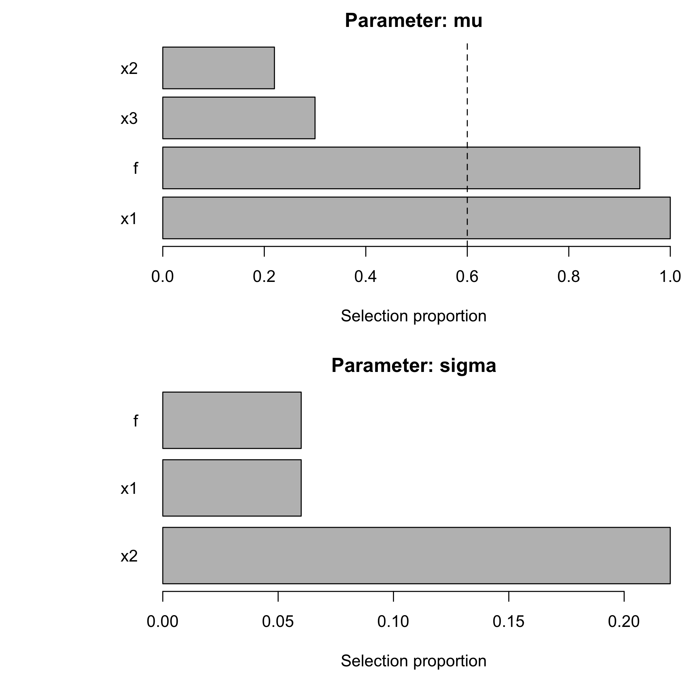
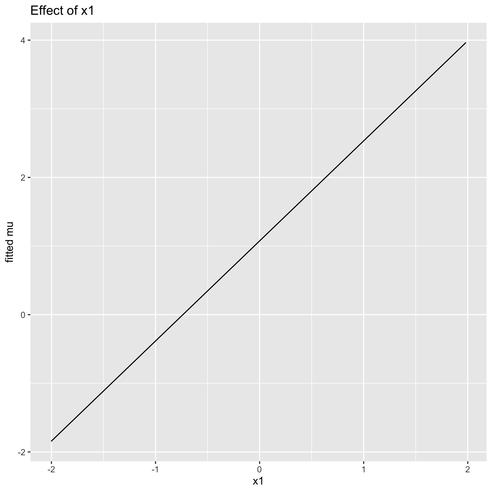
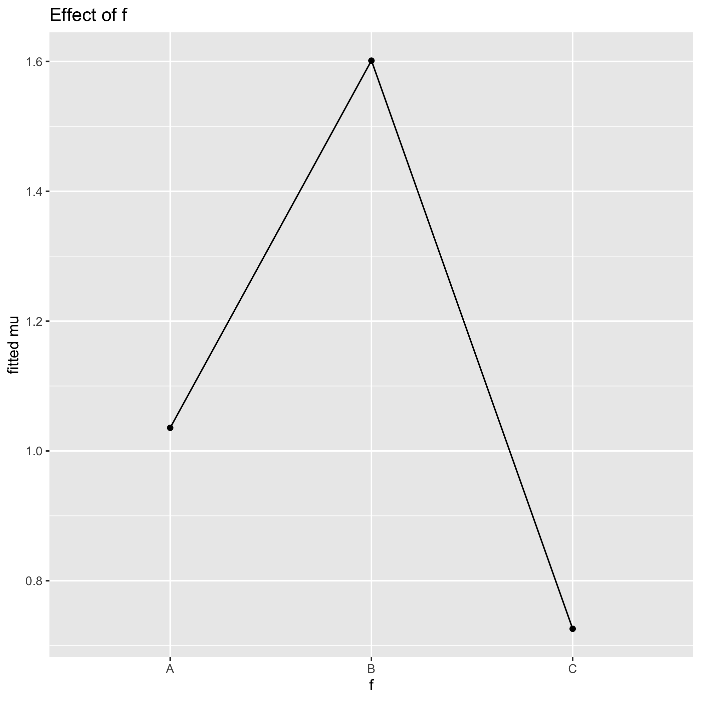
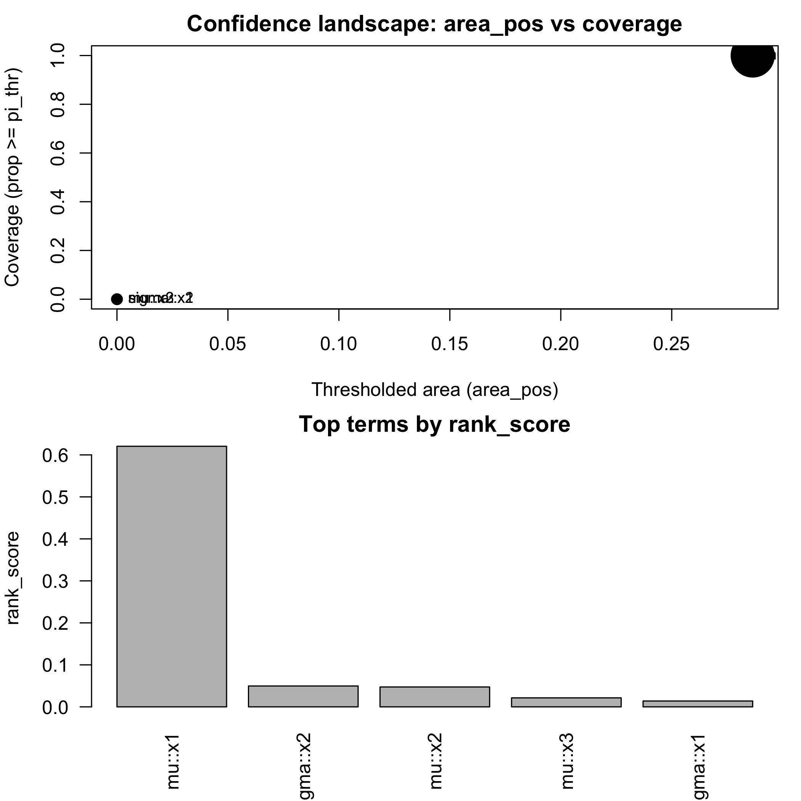
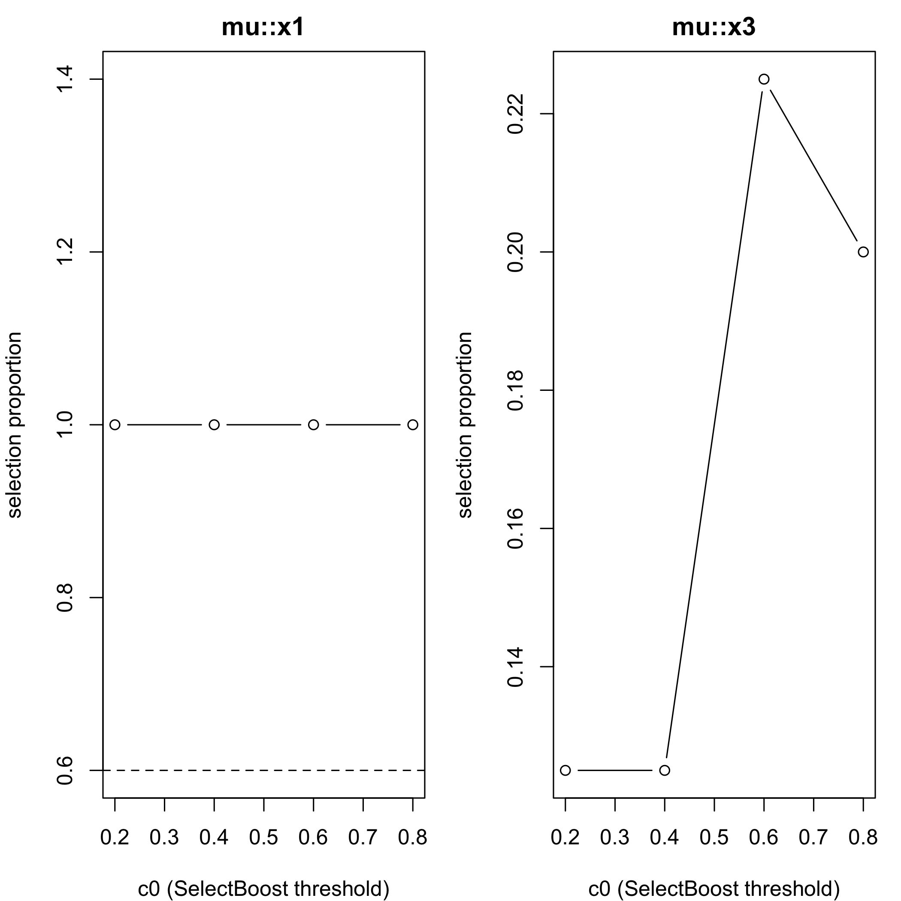

<!-- README.md is generated from README.Rmd. Please edit that file -->


# SelectBoost.gamlss 

<!-- badges: start -->
[](https://doi.org/10.32614/CRAN.package.SelectBoost.gamlss)
[](https://github.com/fbertran/SelectBoost.gamlss/actions)
[](https://cran.r-project.org/package=SelectBoost.gamlss)
<!-- badges: end -->

With the growth of big data, variable selection has become one of the major challenges in statistics. Although many methods have been proposed in the literature their performance in terms of recall and precision are limited in a context where the number of variables by far exceeds the number of observations or in a high correlated setting. 

Results: This package implements an extension of the **SelectBoost** algorithm, F. Bertrand, I. Aouadi, N. Jung, R. Carapito, L. Vallat, S. Bahram, M. Maumy-Bertrand (2015) <https://doi.org/10.1093/bioinformatics/btaa855> and <https://doi.org/10.32614/CRAN.package.SelectBoost>, to **GAMLSS** (Generalized Additive Models for Location, Scale and Shape).

> **Conference highlight.** SelectBoost for GAMLSS and quantile regression was presented at the Joint Statistics Meetings 2024 in Portland, OR, in the talk *"An Improvement for Variable Selection for Generalized Additive Models for Location, Shape and Scale and Quantile Regression"* (Frédéric Bertrand & M. Maumy). The presentation underscored how correlated resampling improves recall and precision in high-dimensional, highly correlated settings.

## Key features
- **Bootstrap stability-selection** for all distribution parameters (μ, σ, ν, τ) with optional SelectBoost grouping over correlation clusters.
- **Multiple engines:** classical stepwise via `gamlss::stepGAIC()`, lasso/ridge/elastic-net via **glmnet**, grouped penalties via **grpreg**/**SGL** (group lasso / sparse group lasso), and per-parameter engine choices.
- **Effect visualisation & summaries:** stability tables/plots, `effect_plot()` for partial effects, and grid-based confidence summaries.
- **Automation helpers:** `sb_gamlss_c0_grid()`, `autoboost_gamlss()`, `fastboost_gamlss()`, and `tune_sb_gamlss()` for rapid c0/engine sweeps with progress bars.
- **Fast deviance evaluation** for deviance-based tuning with optimized density shortcuts across many `gamlss.dist` families plus accuracy checks.
- **Parallel + compiled speedups:** C++ scaling/correlation + optional `future.apply` parallelism for bootstrap replications.
- **Additional tooling:** approximate knockoff filters, `AICc_gamlss()` helper, and reproducible benchmarking utilities.

The SelectBoost algorithm improves the precision of existing variable-selection methods by exploiting correlation-aware resampling. It can deliver confidence indices for variable inclusion or guide the design of future experiments. This website and these examples were created by F. Bertrand.

## Installation

You can install the released version of SelectBoost.gamlss from [CRAN](https://CRAN.R-project.org) with:


``` r
install.packages("SelectBoost.gamlss")
```

You can install the development version of SelectBoost.gamlss from [github](https://github.com) with:


``` r
devtools::install_github("fbertran/SelectBoost.gamlss")
```

If you are a Linux/Unix or a Macos user, you can install a version of SelectBoost.gamlss with support for `doMC` from [github](https://github.com) with:


``` r
devtools::install_github("fbertran/SelectBoost.gamlss", ref = "doMC")
```


## Quick start


``` r
library(SelectBoost.gamlss)
```


``` r
set.seed(1)
n <- 400
x1 <- rnorm(n); x2 <- rnorm(n); x3 <- rnorm(n)
f  <- factor(sample(c("A","B","C"), n, replace = TRUE))
mu <- 1 + 1.5*x1 + ifelse(f == "B", 0.6, ifelse(f == "C", -0.4, 0))
y  <- gamlss.dist::rNO(n, mu = mu, sigma = 1)
dat <- data.frame(y, x1, x2, x3, f)
```


``` r
res <- sb_gamlss(
  y ~ 1,
  mu_scope = ~ x1 + x2 + x3 + f,
  sigma_scope = ~ x1 + x2 + f,
  family = gamlss.dist::NO(),
  data = dat,
  B = 50,
  sample_fraction = 0.7,
  pi_thr = 0.6,
  k = 2, # AIC
  pre_standardize = TRUE,
  trace = FALSE
)

res$final_formula
#> $mu
#> y ~ x1 + f
#> 
#> $sigma
#> ~1
#> <environment: 0x3377327e0>
#> 
#> $nu
#> ~1
#> <environment: 0x3377327e0>
#> 
#> $tau
#> ~1
#> <environment: 0x3377327e0>
sel <- selection_table(res)
sel <- sel[order(sel$parameter, -sel$prop), , drop = FALSE]
head(sel, n = min(8L, nrow(sel)))
#>   parameter term count prop
#> 1        mu   x1    50 1.00
#> 4        mu    f    47 0.94
#> 3        mu   x3    15 0.30
#> 2        mu   x2    11 0.22
#> 6     sigma   x2    11 0.22
#> 5     sigma   x1     3 0.06
#> 7     sigma    f     3 0.06
stable <- sel[sel$prop >= res$pi_thr, , drop = FALSE]
if (nrow(stable)) {
  stable
} else {
  cat("No terms reached the stability threshold of", res$pi_thr, "for this run.\n")
}
#>   parameter term count prop
#> 1        mu   x1    50 1.00
#> 4        mu    f    47 0.94
plot_sb_gamlss(res)
```

<div class="figure">

<p class="caption">plot of chunk unnamed-chunk-13</p>
</div>

``` r
if (requireNamespace("ggplot2", quietly = TRUE)) {
  print(effect_plot(res, "x1", dat, what = "mu"))
  print(effect_plot(res, "f", dat, what = "mu"))
}
```

<div class="figure">

<p class="caption">plot of chunk unnamed-chunk-13</p>
</div><div class="figure">

<p class="caption">plot of chunk unnamed-chunk-13</p>
</div>

`selection_table()` ranks the most stable terms per parameter; the code prints the top eight entries and isolates those that clear the stability threshold. `plot_sb_gamlss()` overlays stability vs frequency, and `effect_plot()` provides partial-effect diagnostics for the final model (numeric and factor effects; falls back to base graphics if **ggplot2** is unavailable).


### SelectBoost integration
- Uses `SelectBoost::group_func_2()` to form correlation groups (c0) and sample one representative per group in each bootstrap.
- Wrapper `SelectBoost_gamlss()` mirrors SelectBoost naming and enables grouping by default.


### Four-parameter example (BCT family)


``` r
set.seed(2)
n_bct <- 300
z1 <- rnorm(n_bct)
z2 <- runif(n_bct)
mu_bct <- 1 + 0.8 * z1
sigma_bct <- exp(-0.4 + 0.6 * z2)
nu_bct <- -0.2 + 0.5 * z1
tau_bct <- 0.3 + 0.4 * z2
y_bct <- gamlss.dist::rBCT(n_bct, mu = mu_bct, sigma = sigma_bct, nu = nu_bct, tau = tau_bct)
#> Error in gamlss.dist::rBCT(n_bct, mu = mu_bct, sigma = sigma_bct, nu = nu_bct, : mu must be positive 
#> 
dat_bct <- data.frame(y_bct, z1, z2)
#> Error: object 'y_bct' not found
fit_bct <- sb_gamlss(
  y_bct ~ 1,
  mu_scope = ~ z1 + z2,
  sigma_scope = ~ z1 + z2,
  nu_scope = ~ z1,
  tau_scope = ~ z2,
  family = gamlss.dist::BCT(),
  data = dat_bct,
  B = 35,
  sample_fraction = 0.65,
  pi_thr = 0.55,
  trace = FALSE
)
#> Error: object 'dat_bct' not found
fit_bct$final_formula
#> Error: object 'fit_bct' not found
selection_table(fit_bct)[selection_table(fit_bct)$prop >= fit_bct$pi_thr, ]
#> Error: object 'fit_bct' not found
```

This quick-start illustrates how multi-parameter families expose additional scopes: ν and τ selections recover the simulated structure alongside μ/σ.


## c0 grid + confidence + Auto/Fast

``` r
# grid over c0 and plot
g <- sb_gamlss_c0_grid(
  y ~ 1, data = dat, family = gamlss.dist::NO(),
  mu_scope = ~ x1 + x2 + x3, sigma_scope = ~ x1 + x2,
  c0_grid = seq(0.2, 0.8, by = 0.2), B = 40, pi_thr = 0.6, pre_standardize = TRUE, trace = FALSE,
  progress = TRUE
)
#> 
  |                                                                                                  
  |                                                                                            |   0%
  |                                                                                                  
  |=======================                                                                     |  25%
  |                                                                                                  
  |==============================================                                              |  50%
  |                                                                                                  
  |=====================================================================                       |  75%
#> Warning in RS(): Algorithm RS has not yet converged
#> Warning in RS(): Algorithm RS has not yet converged
#> 
  |                                                                                                  
  |============================================================================================| 100%
plot(g)                 # stable terms vs c0 + top confidence terms
```

<div class="figure">

<p class="caption">plot of chunk unnamed-chunk-15</p>
</div>

``` r
confidence_table(g)     # SelectBoost-like confidence summary
#>   parameter term conf_index cover
#> 1        mu   x1        0.4     1
#> 2     sigma   x1        0.0     0
#> 3        mu   x2        0.0     0
#> 4     sigma   x2        0.0     0
#> 5        mu   x3        0.0     0

# autoboost: pick best c0 automatically
ab <- autoboost_gamlss(
  y ~ 1, data = dat, family = gamlss.dist::NO(),
  mu_scope = ~ x1 + x2 + x3, sigma_scope = ~ x1 + x2,
  c0_grid = seq(0.2, 0.8, by = 0.2), B = 40, pi_thr = 0.6, pre_standardize = TRUE, trace = FALSE
)
#> 
  |                                                                                                  
  |                                                                                            |   0%
#> Warning in RS(): Algorithm RS has not yet converged
#> 
  |                                                                                                  
  |=======================                                                                     |  25%
  |                                                                                                  
  |==============================================                                              |  50%
  |                                                                                                  
  |=====================================================================                       |  75%
  |                                                                                                  
  |============================================================================================| 100%
attr(ab, "chosen_c0")
#> [1] 0.2
attr(ab, "confidence_table") |> head()
#>   parameter term conf_index cover
#> 1        mu   x1        0.4     1
#> 2     sigma   x1        0.0     0
#> 3        mu   x2        0.0     0
#> 4     sigma   x2        0.0     0
#> 5        mu   x3        0.0     0
plot(ab)
#> Error in xy.coords(x, y, xlabel, ylabel, log): 'x' is a list, but does not have components 'x' and 'y'

# fastboost: lightweight stability selection
fb <- fastboost_gamlss(
  y ~ 1, data = dat, family = gamlss.dist::NO(),
  mu_scope = ~ x1 + x2 + x3, sigma_scope = ~ x1 + x2,
  B = 30, sample_fraction = 0.6, pi_thr = 0.6, pre_standardize = TRUE, trace = FALSE
)
plot(fb)
#> Error in xy.coords(x, y, xlabel, ylabel, log): 'x' is a list, but does not have components 'x' and 'y'
```

Use `progress = TRUE` on grid/autoboost helpers to monitor c0 sweeps, and pair `fastboost_gamlss()` with smaller `B`/`sample_fraction` for rapid diagnostics.

### Confidence functionals + plots

``` r
g <- sb_gamlss_c0_grid(...)
#> Error: '...' used in an incorrect context
cf <- confidence_functionals(g, pi_thr = 0.6, weight_fun = function(c0) (1 - c0)^2,
                             conservative = TRUE, B = 30)
plot(cf)  # scatter (area_pos vs cover) + top-N bars
```

<div class="figure">

<p class="caption">plot of chunk unnamed-chunk-16</p>
</div>

``` r
plot_stability_curves(g, terms = c("x1","x3"), parameter = "mu")
```

<div class="figure">

<p class="caption">plot of chunk unnamed-chunk-16</p>
</div>

Combine these summaries with `effect_plot()` outputs (shown in the quick start) or `selection_table()` to understand which effects drive the final refit.

### Performance: Rcpp and Parallel Bootstraps
- Uses **RcppArmadillo** for fast scaling and correlations (grouping).
- Optional parallel bootstraps via **future.apply**: `parallel = "auto"` (or set your own plan).
```r
future::plan(multisession, workers = 4)
fit <- sb_gamlss(..., B = 200, parallel = "auto", trace = FALSE)
```

### Glmnet engines (lasso/ridge/elastic-net) for μ-selection
Enable `engine = "glmnet"` and choose `glmnet_alpha`:
- `glmnet_alpha = 1` → **lasso**
- `glmnet_alpha = 0` → **ridge**
- `0 < glmnet_alpha < 1` → **elastic-net**
- `glmnet_family` controls the underlying glmnet path (`"gaussian"`, `"binomial"`, or `"poisson"`).


``` r
fit <- sb_gamlss(
  y ~ 1, data = dat, family = gamlss.dist::NO(),
  mu_scope = ~ x1 + x2 + x3,
  engine = "glmnet", glmnet_alpha = 1,  # lasso
  B = 60, pi_thr = 0.6, pre_standardize = TRUE,
  parallel = "auto", trace = FALSE
)
```


### Group lasso & sparse group lasso (broader structured selection)
For **factors**, **splines** (e.g., `pb(x)`, `bs(x)`), and **interactions**, use grouped engines:

- `engine = "grpreg"` → group lasso (or `penalty = "grMCP"`, `"grSCAD"` inside helper if you change it).
- `engine = "sgl"`    → sparse group lasso (mixes group & within-group sparsity).

Groups are built from `mu_scope` term labels via `model.matrix(~ 0 + terms)` and the column `assign` mapping:
all dummy columns for a factor are one group; all spline basis columns are one group; interaction columns form a group.

Use `options(SelectBoost.gamlss.term_converters = list(function(term, df_smooth) ...))` to register custom term converters if you rely on additional smoother constructors; the helpers now convert `pb()`, `cs()`, `pbm()`, and `lo()` out-of-the-box.


``` r
fit_gl <- sb_gamlss(
  y ~ 1, data = dat, family = gamlss.dist::NO(),
  mu_scope = ~ f + x1 + pb(x2) + x1:f,   # factors, splines, interactions
  engine = "grpreg",                      # or engine = "sgl"
  B = 80, pi_thr = 0.6, pre_standardize = TRUE,
  parallel = "auto", trace = FALSE
)
```


### Parameter-specific engines & penalties
You can choose different selection engines per parameter:
- `engine` (μ), and `engine_sigma`, `engine_nu`, `engine_tau`.
- Engines: `"stepGAIC"`, `"glmnet"`, `"grpreg"` (group lasso / MCP / SCAD via `grpreg_penalty`), `"sgl"` (sparse group lasso with `sgl_alpha`).

Example:

``` r
fit <- sb_gamlss(
  y ~ 1, data = dat, family = gamlss.dist::NO(),
  mu_scope    = ~ f + x1 + pb(x2) + x1:f,
  sigma_scope = ~ f + x1,
  engine = "grpreg",              # μ via group lasso
  engine_sigma = "sgl",           # σ via sparse group lasso
  grpreg_penalty = "grLasso",
  sgl_alpha = 0.9,
  B = 80, pi_thr = 0.6, pre_standardize = TRUE, parallel = "auto"
)
#> GAMLSS-RS iteration 1: Global Deviance = 1629.75 
#> GAMLSS-RS iteration 2: Global Deviance = 1629.519 
#> GAMLSS-RS iteration 3: Global Deviance = 1629.443 
#> GAMLSS-RS iteration 4: Global Deviance = 1629.418 
#> GAMLSS-RS iteration 5: Global Deviance = 1629.411 
#> GAMLSS-RS iteration 6: Global Deviance = 1629.408 
#> GAMLSS-RS iteration 7: Global Deviance = 1629.407
```
Note: σ/ν/τ grouped engines use a **working response** from the current fit (on a link-like scale) for the penalized regression.


### Tuning engines/penalties (lightweight)
Use `tune_sb_gamlss()` to search over selection engines/penalties with a small B:

``` r
cfgs <- list(
  list(engine="stepGAIC"),
  list(engine="glmnet", glmnet_alpha=1),
  list(engine="grpreg", grpreg_penalty="grLasso", engine_sigma="sgl", sgl_alpha=0.9)
)
base <- list(
  formula = y ~ 1, data = dat, family = gamlss.dist::NO(),
  mu_scope = ~ f + x1 + pb(x2) + x1:f, sigma_scope = ~ f + x1 + pb(x2),
  pi_thr = 0.6, pre_standardize = TRUE, sample_fraction = 0.7, parallel = "auto", trace = FALSE
)
tuned <- tune_sb_gamlss(cfgs, base_args = base, B_small = 30)
#> 
  |                                                                                                  
  |                                                                                            |   0%
  |                                                                                                  
  |===============================                                                             |  33%
  |                                                                                                  
  |=============================================================                               |  67%
  |                                                                                                  
  |============================================================================================| 100%
tuned$best_config
#> $engine
#> [1] "glmnet"
#> 
#> $glmnet_alpha
#> [1] 1
fit <- tuned$best_fit
```

### (Approximate) group knockoffs for FDR-style control

``` r
# mu
sel_mu <- knockoff_filter_mu(dat, response = "y", mu_scope = ~ f + x1 + pb(x2), fdr = 0.1)
#> Error in X_k * swap.M: non-numeric argument to binary operator

# sigma (using a working response)
fit_tmp <- gamlss::gamlss(y ~ 1, data = dat, family = gamlss.dist::NO())
#> GAMLSS-RS iteration 1: Global Deviance = 1630.118 
#> GAMLSS-RS iteration 2: Global Deviance = 1630.118
ysig <- fitted(fit_tmp, what = "sigma")
sel_sigma <- knockoff_filter_param(dat, sigma_scope, y_work = log(ysig), fdr = 0.1)
#> Error: object 'sigma_scope' not found
```


### Tuning metric: stability or deviance (CV)

``` r
cfgs <- list(
  list(engine="stepGAIC"),
  list(engine="glmnet", glmnet_alpha=1),
  list(engine="grpreg", grpreg_penalty="grLasso", engine_sigma="sgl", sgl_alpha=0.9)
)
base <- list(
  formula = y ~ 1, data = dat, family = gamlss.dist::NO(),
  mu_scope = ~ f + x1 + pb(x2) + x1:f, sigma_scope = ~ f + x1 + pb(x2),
  pi_thr = 0.6, pre_standardize = TRUE, sample_fraction = 0.7, parallel = "auto", trace = FALSE
)
tuned <- tune_sb_gamlss(cfgs, base_args = base, B_small = 20, metric = "deviance", K = 3, progress = TRUE)
#> 
  |                                                                                                  
  |                                                                                            |   0%
  |                                                                                                  
  |===============================                                                             |  33%
#> Warning in RS(): Algorithm RS has not yet converged
#> 
  |                                                                                                  
  |=============================================================                               |  67%
  |                                                                                                  
  |============================================================================================| 100%
tuned$metrics
#> NULL
```

The returned tibble reports mean deviance and rank per configuration, confirming the fast-path deviance shortcut agrees with the full `logLik` evaluation across the grid.

### Progress bars
- `sb_gamlss_c0_grid(..., progress = TRUE)` shows progress across `c0_grid`.
- `tune_sb_gamlss(..., progress = TRUE)` shows progress across configs.


### Benchmark vignette
See `vignettes/benchmark.Rmd` for an apples-to-apples timing comparison of engines on a synthetic dataset.
Run times will vary by hardware and BLAS.


### Fast deviance shortcuts (families & mappings)
The deviance CV now has optimized paths for common families:

| Family | Param notes | Fast density mapping |
|---|---|---|
| NO | μ = mean, σ = sd | `dnorm(y, mean = μ, sd = σ)` |
| PO | μ = mean | `dpois(y, lambda = μ)` |
| LOGNO | μ = meanlog, σ = sdlog | `dlnorm(y, meanlog = μ, sdlog = σ)` |
| GA | Var = (σ²)(μ²) | `dgamma(y, shape = 1/σ², scale = μ·σ²)` |
| IG | Var = σ² μ³ | closed-form: `-½log(2π) - log(σ) - 1.5log(y) - (y-μ)²/(2 μ² σ² y)` |
| NBI | Var = μ + σ μ² | `dnbinom(y, size = 1/σ, mu = μ)` |
| NBII | Var = μ(1+σ) | `dnbinom(y, size = μ/σ, mu = μ)` |
| BI | y = (success, failure) | `dbinom(success, size = success+failure, prob = μ)` |

These mappings follow the `gamlss.dist` parameterizations (see GA, LOGNO/LNO, IG, BI, NBI/NBII documentation).


#### Added fast paths
- **LO** (logistic): `dlogis(y, location = μ, scale = σ)`
- **BE** (beta reparam): with `Var = σ² μ (1 − μ)`, set `φ = 1/σ² − 1`, `α = μ φ`, `β = (1−μ) φ`, then `dbeta(y, α, β)`

#### Native density fallback
Whenever a matching `gamlss.dist::d<family>()` function exists, the fast evaluator now calls it directly (passing along `μ/σ/ν/τ` and trial counts for binomial variants). This automatically covers zero-inflated and hurdle families such as `ZIP`, `ZIP2`, `ZINBI`, `ZIBB`, `ZAGA`, `ZAIG`, `ZALG`, as well as beta-inflated, Delaporte, Paretian, SEP, and many others—without requiring a hand-maintained whitelist. If the native density is unavailable or errors, the code falls back to the generic evaluator.

#### More fast deviance shortcuts
- **LOGITNO** (logit-normal): `z = logit(y)`, `dnorm(z | μ, σ) − log(y) − log(1−y)`
- **GEOM** (geometric, mean-param.): `p = 1/(1+μ)`, then `dgeom(y, p)`

#### Even more native routes
Fast deviance now also tries native **gamlss.dist** densities for:
`ZIPF`, `ZIPFmu`, `BCT`, `BCPE`, `SICHEL`, `GLG`
(automatically falls back to generic density if a family is unavailable).


#### Added more native routes (swept set)
Fast deviance now attempts native `gamlss.dist` densities for:
`BETA4`, `RS`, `WEI`, `GIG` (and previously added sets). If a family is unavailable in your
installed `gamlss.dist`, the code falls back to the generic density resolution.


### Fast deviance benchmark
- Helper: `fast_vs_generic_ll(fit, newdata, reps=100)` compares the fast evaluator to the generic route.
- Vignette: **Fast Deviance: Microbenchmarks** reproduces timing comparisons across multiple families.


### Fast deviance: accuracy
- Helper: `check_fast_vs_generic(fit, newdata, tol)` verifies that fast and generic log-likelihoods agree.
- Vignette: **Fast Deviance: Numerical Equality Checks** shows pass/fail with absolute differences for several families.


### CRAN-friendly long tests & tolerances
- Enable long tests locally via either:
  ```r
  options(SelectBoost.gamlss.run_long_tests = TRUE)  # or
  Sys.setenv(RUN_LONG_TESTS = "true")
  ```
- Equality checks use **per-family tolerances** (see `.family_tolerance()`); heavier-tailed/complex families have slightly looser defaults.


