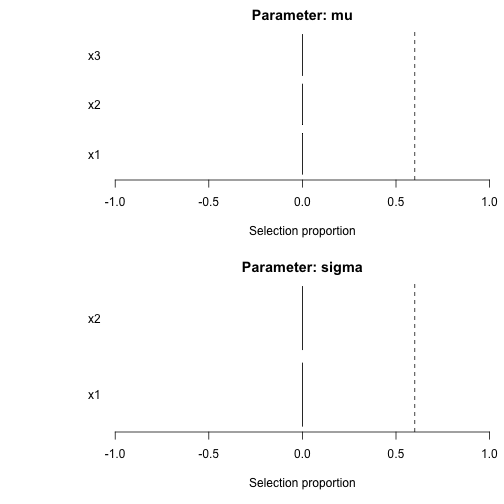
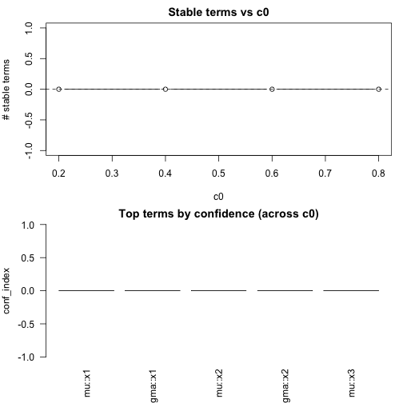
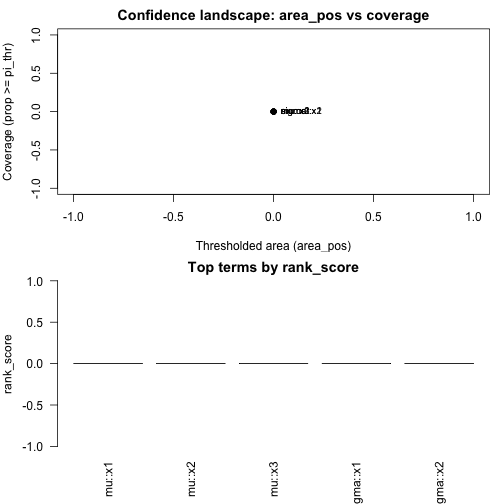
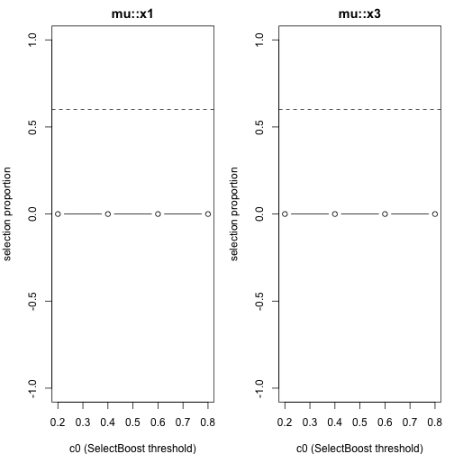

# SelectBoost.gamlss

An extension of the **SelectBoost** idea to **GAMLSS** (Generalized Additive Models for Location, Scale and Shape).

- Bootstrap subsampling + `gamlss::stepGAIC()` on each parameter (mu, sigma, nu, tau).
- Selection frequencies aggregated; refit a final stable model using a threshold `pi_thr`.
- Optional pre-standardization of numeric predictors.
- Includes `AICc_gamlss()` helper.

## Install (local)
Build with `R CMD build` then `R CMD INSTALL`, or `devtools::install_local()`.

## Quick start


``` r
library(gamlss)
```

```
## Loading required package: splines
```

```
## Loading required package: gamlss.data
```

```
## 
## Attaching package: 'gamlss.data'
```

```
## The following object is masked from 'package:datasets':
## 
##     sleep
```

```
## Loading required package: gamlss.dist
```

```
## Loading required package: nlme
```

```
## Loading required package: parallel
```

```
##  **********   GAMLSS Version 5.5-0  **********
```

```
## For more on GAMLSS look at https://www.gamlss.com/
```

```
## Type gamlssNews() to see new features/changes/bug fixes.
```

``` r
library(SelectBoost.gamlss)

set.seed(1)
n <- 400
x1 <- rnorm(n); x2 <- rnorm(n); x3 <- rnorm(n)
mu <- 1 + 1.5*x1
y  <- gamlss.dist::rNO(n, mu = mu, sigma = 1)
dat <- data.frame(y, x1, x2, x3)

res <- sb_gamlss(
  y ~ 1,
  mu_scope = ~ x1 + x2 + x3,
  sigma_scope = ~ x1 + x2,
  family = gamlss.dist::NO(),
  data = dat,
  B = 50,
  sample_fraction = 0.7,
  pi_thr = 0.6,
  k = 2, # AIC
  pre_standardize = TRUE,
  trace = FALSE
)
```

```
## GAMLSS-RS iteration 1: Global Deviance = 1601.648 
## GAMLSS-RS iteration 2: Global Deviance = 1601.648
```

``` r
res$final_formula
```

```
## $mu
## y ~ 1
## 
## $sigma
## ~1
## <environment: 0x302d0aa70>
## 
## $nu
## ~1
## <environment: 0x302d0aa70>
## 
## $tau
## ~1
## <environment: 0x302d0aa70>
```

``` r
head(selection_table(res))
```

```
##   parameter term count prop
## 1        mu   x1     0    0
## 2        mu   x2     0    0
## 3        mu   x3     0    0
## 4     sigma   x1     0    0
## 5     sigma   x2     0    0
```

``` r
plot_sb_gamlss(res)
```




### SelectBoost integration
- Uses `SelectBoost::group_func_2()` to form correlation groups (c0) and sample one representative per group in each bootstrap.
- Wrapper `SelectBoost_gamlss()` mirrors SelectBoost naming and enables grouping by default.


## c0 grid + confidence + Auto/Fast

``` r
# grid over c0 and plot
g <- sb_gamlss_c0_grid(
  y ~ 1, data = dat, family = gamlss.dist::NO(),
  mu_scope = ~ x1 + x2 + x3, sigma_scope = ~ x1 + x2,
  c0_grid = seq(0.2, 0.8, by = 0.2), B = 40, pi_thr = 0.6, pre_standardize = TRUE, trace = FALSE
)
```

```
## 
  |                                                              
  |                                                        |   0%GAMLSS-RS iteration 1: Global Deviance = 1601.648 
## GAMLSS-RS iteration 2: Global Deviance = 1601.648 
## 
  |                                                              
  |==============                                          |  25%GAMLSS-RS iteration 1: Global Deviance = 1601.648 
## GAMLSS-RS iteration 2: Global Deviance = 1601.648 
## 
  |                                                              
  |============================                            |  50%GAMLSS-RS iteration 1: Global Deviance = 1601.648 
## GAMLSS-RS iteration 2: Global Deviance = 1601.648 
## 
  |                                                              
  |==========================================              |  75%GAMLSS-RS iteration 1: Global Deviance = 1601.648 
## GAMLSS-RS iteration 2: Global Deviance = 1601.648 
## 
  |                                                              
  |========================================================| 100%
```

``` r
plot(g)                 # stable terms vs c0 + top confidence terms
```



``` r
confidence_table(g)     # SelectBoost-like confidence summary
```

```
##   parameter term conf_index cover
## 1        mu   x1          0     0
## 2     sigma   x1          0     0
## 3        mu   x2          0     0
## 4     sigma   x2          0     0
## 5        mu   x3          0     0
```

``` r
# autoboost: pick best c0 automatically
ab <- autoboost_gamlss(
  y ~ 1, data = dat, family = gamlss.dist::NO(),
  mu_scope = ~ x1 + x2 + x3, sigma_scope = ~ x1 + x2,
  c0_grid = seq(0.2, 0.8, by = 0.2), B = 40, pi_thr = 0.6, pre_standardize = TRUE, trace = FALSE
)
```

```
## 
  |                                                              
  |                                                        |   0%GAMLSS-RS iteration 1: Global Deviance = 1601.648 
## GAMLSS-RS iteration 2: Global Deviance = 1601.648 
## 
  |                                                              
  |==============                                          |  25%GAMLSS-RS iteration 1: Global Deviance = 1601.648 
## GAMLSS-RS iteration 2: Global Deviance = 1601.648 
## 
  |                                                              
  |============================                            |  50%GAMLSS-RS iteration 1: Global Deviance = 1601.648 
## GAMLSS-RS iteration 2: Global Deviance = 1601.648 
## 
  |                                                              
  |==========================================              |  75%GAMLSS-RS iteration 1: Global Deviance = 1601.648 
## GAMLSS-RS iteration 2: Global Deviance = 1601.648 
## 
  |                                                              
  |========================================================| 100%
```

``` r
attr(ab, "chosen_c0")
```

```
## [1] 0.2
```

``` r
attr(ab, "confidence_table") |> head()
```

```
##   parameter term conf_index cover
## 1        mu   x1          0     0
## 2     sigma   x1          0     0
## 3        mu   x2          0     0
## 4     sigma   x2          0     0
## 5        mu   x3          0     0
```

``` r
plot(ab)
```

```
## Error in xy.coords(x, y, xlabel, ylabel, log): 'x' is a list, but does not have components 'x' and 'y'
```

``` r
# fastboost: lightweight stability selection
fb <- fastboost_gamlss(
  y ~ 1, data = dat, family = gamlss.dist::NO(),
  mu_scope = ~ x1 + x2 + x3, sigma_scope = ~ x1 + x2,
  B = 30, sample_fraction = 0.6, pi_thr = 0.6, pre_standardize = TRUE, trace = FALSE
)
```

```
## GAMLSS-RS iteration 1: Global Deviance = 1601.648 
## GAMLSS-RS iteration 2: Global Deviance = 1601.648
```

``` r
plot(fb)
```

```
## Error in xy.coords(x, y, xlabel, ylabel, log): 'x' is a list, but does not have components 'x' and 'y'
```


### Confidence functionals + plots

``` r
g <- sb_gamlss_c0_grid(...)
```

```
## Error: '...' used in an incorrect context
```

``` r
cf <- confidence_functionals(g, pi_thr = 0.6, weight_fun = function(c0) (1 - c0)^2,
                             conservative = TRUE, B = 60)
plot(cf)  # scatter (area_pos vs cover) + top-N bars
```



``` r
plot_stability_curves(g, terms = c("x1","x3"), parameter = "mu")
```




### Performance: Rcpp and Parallel Bootstraps
- Uses **RcppArmadillo** for fast scaling and correlations (grouping).
- Optional parallel bootstraps via **future.apply**: `parallel = "auto"` (or set your own plan).
```r
future::plan(multisession, workers = 4)
fit <- sb_gamlss(..., B = 200, parallel = "auto", trace = FALSE)
```

### Glmnet engines (lasso/ridge/elastic-net) for μ-selection
Enable `engine = "glmnet"` and choose `glmnet_alpha`:
- `glmnet_alpha = 1` → **lasso**
- `glmnet_alpha = 0` → **ridge**
- `0 < glmnet_alpha < 1` → **elastic-net**


``` r
fit <- sb_gamlss(
  y ~ 1, data = dat, family = gamlss.dist::NO(),
  mu_scope = ~ x1 + x2 + x3,
  engine = "glmnet", glmnet_alpha = 1,  # lasso
  B = 60, pi_thr = 0.6, pre_standardize = TRUE,
  parallel = "auto", trace = FALSE
)
```

```
## GAMLSS-RS iteration 1: Global Deviance = 1601.648 
## GAMLSS-RS iteration 2: Global Deviance = 1601.648
```


### Group lasso & sparse group lasso (broader structured selection)
For **factors**, **splines** (e.g., `pb(x)`, `bs(x)`), and **interactions**, use grouped engines:

- `engine = "grpreg"` → group lasso (or `penalty = "grMCP"`, `"grSCAD"` inside helper if you change it).
- `engine = "sgl"`    → sparse group lasso (mixes group & within-group sparsity).

Groups are built from `mu_scope` term labels via `model.matrix(~ 0 + terms)` and the column `assign` mapping:
all dummy columns for a factor are one group; all spline basis columns are one group; interaction columns form a group.


``` r
fit_gl <- sb_gamlss(
  y ~ 1, data = dat, family = gamlss.dist::NO(),
  mu_scope = ~ f + x1 + pb(x2) + x1:f,   # factors, splines, interactions
  engine = "grpreg",                      # or engine = "sgl"
  B = 80, pi_thr = 0.6, pre_standardize = TRUE,
  parallel = "auto", trace = FALSE
)
```

```
## GAMLSS-RS iteration 1: Global Deviance = 1601.648 
## GAMLSS-RS iteration 2: Global Deviance = 1601.648
```


### Parameter-specific engines & penalties
You can choose different selection engines per parameter:
- `engine` (μ), and `engine_sigma`, `engine_nu`, `engine_tau`.
- Engines: `"stepGAIC"`, `"glmnet"`, `"grpreg"` (group lasso / MCP / SCAD via `grpreg_penalty`), `"sgl"` (sparse group lasso with `sgl_alpha`).

Example:

``` r
fit <- sb_gamlss(
  y ~ 1, data = dat, family = gamlss.dist::NO(),
  mu_scope    = ~ f + x1 + pb(x2) + x1:f,
  sigma_scope = ~ f + x1,
  engine = "grpreg",              # μ via group lasso
  engine_sigma = "sgl",           # σ via sparse group lasso
  grpreg_penalty = "grLasso",
  sgl_alpha = 0.9,
  B = 80, pi_thr = 0.6, pre_standardize = TRUE, parallel = "auto"
)
```

```
## Bootstrapping 80 replicates...
```

```
## GAMLSS-RS iteration 1: Global Deviance = 1601.648 
## GAMLSS-RS iteration 2: Global Deviance = 1601.648
```
Note: σ/ν/τ grouped engines use a **working response** from the current fit (on a link-like scale) for the penalized regression.


### Tuning engines/penalties (lightweight)
Use `tune_sb_gamlss()` to search over selection engines/penalties with a small B:

``` r
cfgs <- list(
  list(engine="stepGAIC"),
  list(engine="glmnet", glmnet_alpha=1),
  list(engine="grpreg", grpreg_penalty="grLasso", engine_sigma="sgl", sgl_alpha=0.9)
)
base <- list(
  formula = y ~ 1, data = dat, family = gamlss.dist::NO(),
  mu_scope = ~ f + x1 + pb(x2) + x1:f, sigma_scope = ~ f + x1 + pb(x2),
  pi_thr = 0.6, pre_standardize = TRUE, sample_fraction = 0.7, parallel = "auto", trace = FALSE
)
tuned <- tune_sb_gamlss(cfgs, base_args = base, B_small = 30)
```

```
## 
  |                                                              
  |                                                        |   0%GAMLSS-RS iteration 1: Global Deviance = 1601.648 
## GAMLSS-RS iteration 2: Global Deviance = 1601.648 
## 
  |                                                              
  |===================                                     |  33%GAMLSS-RS iteration 1: Global Deviance = 1601.648 
## GAMLSS-RS iteration 2: Global Deviance = 1601.648 
## 
  |                                                              
  |=====================================                   |  67%GAMLSS-RS iteration 1: Global Deviance = 1601.648 
## GAMLSS-RS iteration 2: Global Deviance = 1601.648 
## 
  |                                                              
  |========================================================| 100%
```

``` r
tuned$best_config
```

```
## $engine
## [1] "stepGAIC"
```

``` r
fit <- tuned$best_fit
```

### (Approximate) group knockoffs for FDR-style control

``` r
# mu
sel_mu <- knockoff_filter_mu(dat, response = "y", mu_scope = ~ f + x1 + pb(x2), fdr = 0.1)
```

```
## Error in model.frame.default(object, data, xlev = xlev): invalid type (language) for variable 'f'
```

``` r
# sigma (using a working response)
fit_tmp <- gamlss::gamlss(y ~ 1, data = dat, family = gamlss.dist::NO())
```

```
## GAMLSS-RS iteration 1: Global Deviance = 1601.648 
## GAMLSS-RS iteration 2: Global Deviance = 1601.648
```

``` r
ysig <- fitted(fit_tmp, what = "sigma")
sel_sigma <- knockoff_filter_param(dat, sigma_scope, y_work = log(ysig), fdr = 0.1)
```

```
## Error: object 'sigma_scope' not found
```


### Tuning metric: stability or deviance (CV)

``` r
cfgs <- list(
  list(engine="stepGAIC"),
  list(engine="glmnet", glmnet_alpha=1),
  list(engine="grpreg", grpreg_penalty="grLasso", engine_sigma="sgl", sgl_alpha=0.9)
)
base <- list(
  formula = y ~ 1, data = dat, family = gamlss.dist::NO(),
  mu_scope = ~ f + x1 + pb(x2) + x1:f, sigma_scope = ~ f + x1 + pb(x2),
  pi_thr = 0.6, pre_standardize = TRUE, sample_fraction = 0.7, parallel = "auto", trace = FALSE
)
tuned <- tune_sb_gamlss(cfgs, base_args = base, B_small = 20, metric = "deviance", K = 3, progress = TRUE)
```

```
## 
  |                                                              
  |                                                        |   0%GAMLSS-RS iteration 1: Global Deviance = 1074.104 
## GAMLSS-RS iteration 2: Global Deviance = 1074.104 
## GAMLSS-RS iteration 1: Global Deviance = 1072.832 
## GAMLSS-RS iteration 2: Global Deviance = 1072.832 
## GAMLSS-RS iteration 1: Global Deviance = 1055.643 
## GAMLSS-RS iteration 2: Global Deviance = 1055.643 
## GAMLSS-RS iteration 1: Global Deviance = 1601.648 
## GAMLSS-RS iteration 2: Global Deviance = 1601.648 
## 
  |                                                              
  |===================                                     |  33%GAMLSS-RS iteration 1: Global Deviance = 1066.822 
## GAMLSS-RS iteration 2: Global Deviance = 1066.822 
## GAMLSS-RS iteration 1: Global Deviance = 1072.463 
## GAMLSS-RS iteration 2: Global Deviance = 1072.463 
## GAMLSS-RS iteration 1: Global Deviance = 1063.535 
## GAMLSS-RS iteration 2: Global Deviance = 1063.535 
## GAMLSS-RS iteration 1: Global Deviance = 1601.648 
## GAMLSS-RS iteration 2: Global Deviance = 1601.648 
## 
  |                                                              
  |=====================================                   |  67%GAMLSS-RS iteration 1: Global Deviance = 1058.022 
## GAMLSS-RS iteration 2: Global Deviance = 1058.022 
## GAMLSS-RS iteration 1: Global Deviance = 1047.909 
## GAMLSS-RS iteration 2: Global Deviance = 1047.909 
## GAMLSS-RS iteration 1: Global Deviance = 1092.609 
## GAMLSS-RS iteration 2: Global Deviance = 1092.609 
## GAMLSS-RS iteration 1: Global Deviance = 1601.648 
## GAMLSS-RS iteration 2: Global Deviance = 1601.648 
## 
  |                                                              
  |========================================================| 100%
```

### Progress bars
- `sb_gamlss_c0_grid(..., progress = TRUE)` shows progress across `c0_grid`.
- `tune_sb_gamlss(..., progress = TRUE)` shows progress across configs.


### Benchmark vignette
See `vignettes/benchmark.Rmd` for an apples-to-apples timing comparison of engines on a synthetic dataset.
Run times will vary by hardware and BLAS.


### Fast deviance shortcuts (families & mappings)
The deviance CV now has optimized paths for common families:

| Family | Param notes | Fast density mapping |
|---|---|---|
| NO | μ = mean, σ = sd | `dnorm(y, mean = μ, sd = σ)` |
| PO | μ = mean | `dpois(y, lambda = μ)` |
| LOGNO | μ = meanlog, σ = sdlog | `dlnorm(y, meanlog = μ, sdlog = σ)` |
| GA | Var = (σ²)(μ²) | `dgamma(y, shape = 1/σ², scale = μ·σ²)` |
| IG | Var = σ² μ³ | closed-form: `-½log(2π) - log(σ) - 1.5log(y) - (y-μ)²/(2 μ² σ² y)` |
| NBI | Var = μ + σ μ² | `dnbinom(y, size = 1/σ, mu = μ)` |
| NBII | Var = μ(1+σ) | `dnbinom(y, size = μ/σ, mu = μ)` |
| BI | y = (success, failure) | `dbinom(success, size = success+failure, prob = μ)` |

These mappings follow the `gamlss.dist` parameterizations (see GA, LOGNO/LNO, IG, BI, NBI/NBII documentation).


#### Added fast paths
- **LO** (logistic): `dlogis(y, location = μ, scale = σ)`
- **BE** (beta reparam): with `Var = σ² μ (1 − μ)`, set `φ = 1/σ² − 1`, `α = μ φ`, `β = (1−μ) φ`, then `dbeta(y, α, β)`

Other common families without base R equivalents are evaluated via their native **gamlss.dist** densities (already optimized in C/R):
- **ZIP** → `gamlss.dist::dZIP`
- **ZINBI** → `gamlss.dist::dZINBI`
- **DPO** → `gamlss.dist::dDPO`
- **GPO** → `gamlss.dist::dGPO`


#### Additional native routes
We now also route these families through their native **gamlss.dist** densities when present:
- **LOGLOG** (log-logistic) → `dLOGLOG`
- **DEL** (Delaporte) → `dDEL`
- **ZAGA** (zero-adjusted gamma) → `dZAGA`
- **ZIP2** → tries `dZIP2` if available; otherwise falls back to the generic density mechanism.


#### More fast deviance shortcuts
- **LOGITNO** (logit-normal): `z = logit(y)`, `dnorm(z | μ, σ) − log(y) − log(1−y)`
- **GEOM** (geometric, mean-param.): `p = 1/(1+μ)`, then `dgeom(y, p)`

#### Additional native routes (auto)
Fast path now also tries native `gamlss.dist` densities for:
`ZAIG`, `ZALG`, `ZIBI`, `ZIBB`, `PARETO`, `SEP1`, `SEP2` (falls back generically if missing).


#### Even more native routes
Fast deviance now also tries native **gamlss.dist** densities for:
`ZIPF`, `ZIPFmu`, `BCT`, `BCPE`, `SICHEL`, `GLG`
(automatically falls back to generic density if a family is unavailable).


#### Added more native routes (swept set)
Fast deviance now attempts native `gamlss.dist` densities for:
`BETA4`, `RS`, `WEI`, `GIG` (and previously added sets). If a family is unavailable in your
installed `gamlss.dist`, the code falls back to the generic density resolution.


### Fast deviance benchmark
- Helper: `fast_vs_generic_ll(fit, newdata, reps=100)` compares the fast evaluator to the generic route.
- Vignette: **Fast Deviance: Microbenchmarks** reproduces timing comparisons across multiple families.


### Fast deviance: accuracy
- Helper: `check_fast_vs_generic(fit, newdata, tol)` verifies that fast and generic log-likelihoods agree.
- Vignette: **Fast Deviance: Numerical Equality Checks** shows pass/fail with absolute differences for several families.


### CRAN-friendly long tests & tolerances
- Enable long tests locally via either:
  ```r
  options(SelectBoost.gamlss.run_long_tests = TRUE)  # or
  Sys.setenv(RUN_LONG_TESTS = "true")
  ```
- Equality checks use **per-family tolerances** (see `.family_tolerance()`); heavier-tailed/complex families have slightly looser defaults.


